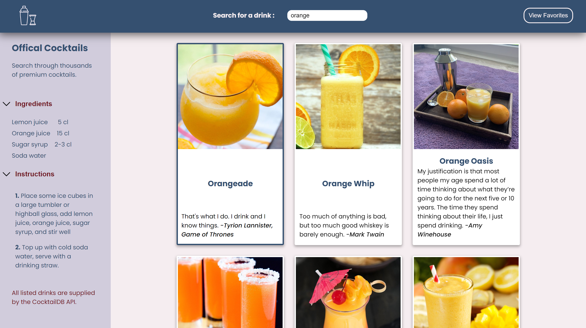

# Cocktail_app

  

- This is an updated and reimagined version of an previous app I built. The original (seen here: https://github.com/Echophase44/Drinks_Mixer) was created using the basic HTML, CSS and JS.
- I wanted to re-create it in React with a better, mobile friendly layout, with more features.

## Icons and Image Credits

<a href="https://www.flaticon.com/free-icons/left" title="left icons">Left icons created by th studio - Flaticon</a>
<a href="https://www.flaticon.com/free-icons/shaker" title="shaker icons">Shaker icons created by Freepik - Flaticon</a>
<a href="https://www.flaticon.com/free-icons/bookmark" title="bookmark icons">Bookmark icons created by nawicon - Flaticon</a>

### Extra Features

- While I could add these extra features, I have a limited amount of time to spend on learning and building. At some point, we all have to move on when we accomplish the goal we set out out to do. Maybe I'll come back to this at some point to add a few things, but for now, I'll leave this as my stopping point. Here's a few things I could add in the future:

- Add a number count of how many items in favorites.
- When a card is selected, have the background turn all blue and text change to white to have the card stand out more.
- Add language selection for the instructions.
- Add permanance to favorites (either local storage or linking a DB).
